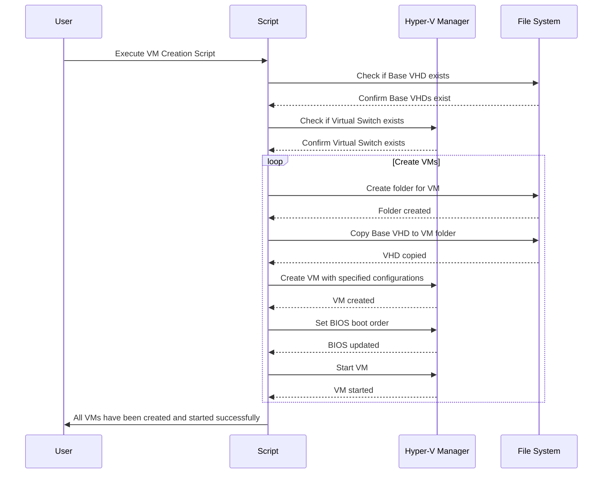
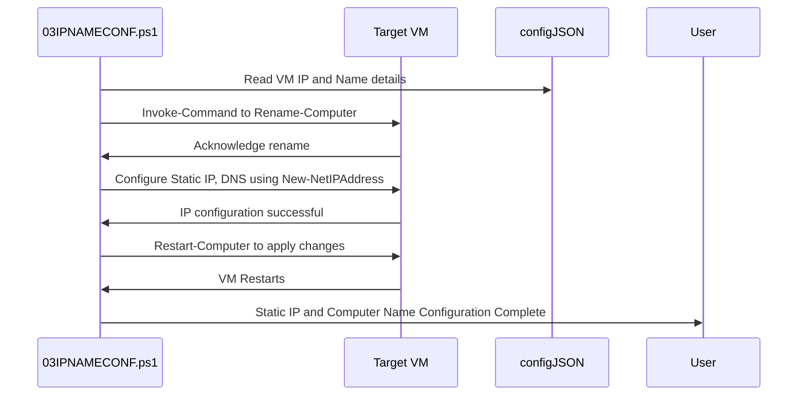
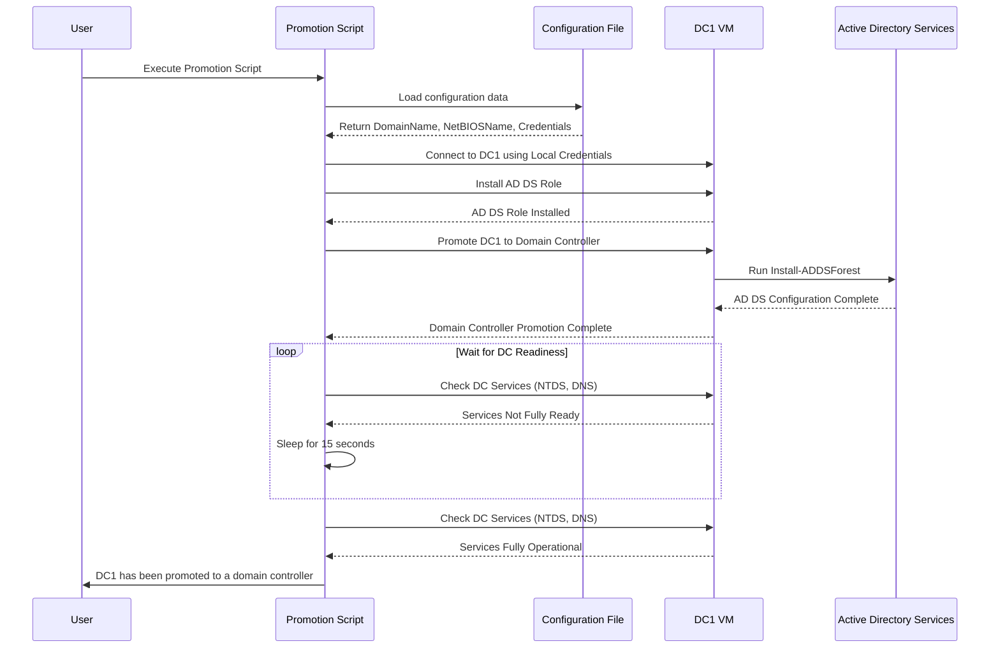
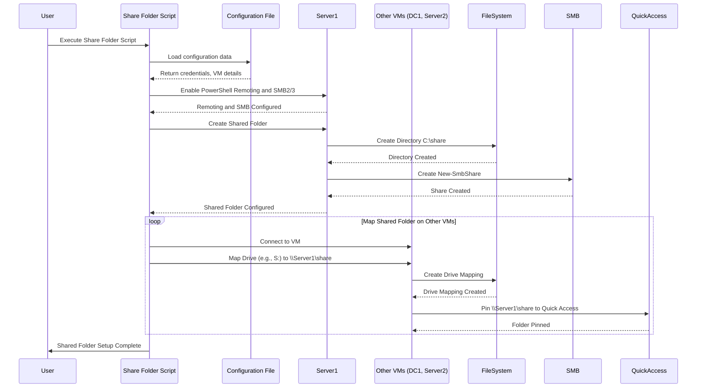
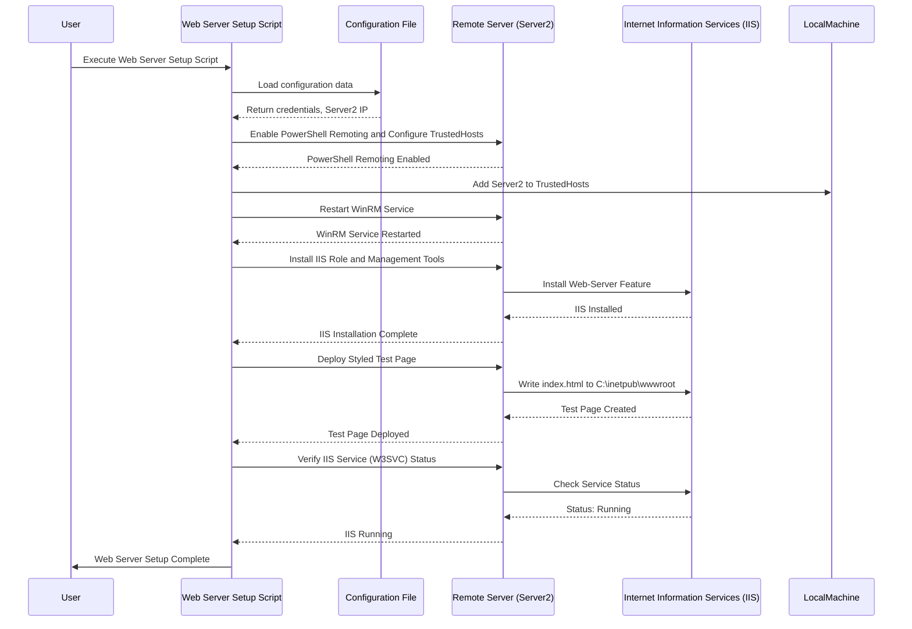

#### Technical Documentation for the Automated Lab Environment

This documentation provides a deeply detailed and technically comprehensive overview of an automated lab environment deployed and configured via a suite of PowerShell scripts. It is intended for technical personnel such as system administrators, consultants, or IT professionals who need to understand every aspect of how this environment is built, configured, and how the scripts interrelate. The documentation also includes sequence diagrams to illustrate the interactions and execution flow between scripts and systems.
#### <u>Table of Contents</u>
1. [Introduction](#introduction)
2. [Prerequisites and Requirements](#prerequisites-and-requirements)
3. [Architecture and Components](#architecture-and-components)
4. [Configuration File](#configuration-file-configjson)
5. [Script Overviews and Detailed Workflows](#script-overviews-and-detailed-workflows)
    - [0CONFIG.ps1 (Configuration Generator)](#0configps1-configuration-generator)
    - [01MAIN.ps1 (Main Script)](#01mainps1-main-script)
    - [02CLIENTDCSRV12.ps1 (VM Creation)](#02clientdcsrv12ps1-vm-creation)
    - [03IPNAMECONF.ps1 (Static IP and Computer Name Configuration)](#03ipnameconfps1-static-ip-and-computer-name-configuration)
    - [04PROMOTEDC.ps1 (Domain Controller Promotion)](#04promotedcps1-domain-controller-promotion)
    - [05JOINDOMAIN.ps1 (Domain Join)](#05joindomainps1-domain-join)
    - [06CREATEOUANDUSERS.ps1 (Organizational Units and Users)](#06createouandusersps1-organizational-units-and-users)
    - [07SHARE.ps1 (Shared Folder Setup)](#07shareps1-shared-folder-setup)
    - [08WEBSERVER.ps1 (Web Server Setup)](#08webserverps1-web-server-setup)
6. [Script Execution Sequence](#script-execution-sequence)
7. [Error Handling, Logging, and Security Considerations](#error-handling-logging-and-security-considerations)
8. [Potential Enhancements](#potential-enhancements)

#### <u>Introduction</u>

This suite of PowerShell scripts fully automates the creation of a Windows-based test, development, or training lab environment within Hyper-V. The environment includes:

- Automatically created and configured VMs (Domain Controller, servers, and Windows 10 clients).
- A fully functional Active Directory domain with OUs, users, and standardized network settings.
- Shared folders accessible to multiple VMs.
- A test web server (IIS) running on a dedicated VM.

#### <u>Prerequisites and Requirements</u>

- **Operating System:** Host machine must run Windows 10 Pro or later, supporting Hyper-V.
- **Hyper-V Enabled:** The host must have the Hyper-V feature enabled to manage and create VMs.
- **PowerShell 5.1 or later:** Required to run these scripts.
- **Base VHDX Files:** Two preconfigured VHDX files are required:
  - **Server VHDX:** Used to spawn DC and server VMs.
  - **Windows 10 VHDX:** Used to spawn client VMs.
- **Hardware Requirements:**
  - At least 32 GB RAM (to run multiple VMs).
  - 1 TB SSD for fast storage and VM access.
- **Network Configuration:** A working virtual switch in Hyper-V.
- **Administrator Privileges:** All scripts must be run as an administrator.

#### <u>Architecture and Components</u>

The environment typically consists of:

- **VMs:**
  - **DC1:** Domain Controller (Windows Server), hosts AD DS, DNS.
  - **Server1, Server2:** Member servers in the domain.
    - Server1 hosts a shared folder.
    - Server2 hosts an IIS-based test web server.
  - **Win10Client:** A Windows 10 client machine joined to the domain.

- **Network Setup:**
  - Static IPs assigned to each VM.
  - A consistent subnet, gateway, and DNS setup (DC1 as DNS).

- **Active Directory:**
  - A new AD domain.
  - Organizational Units (e.g., `NewDivision`, `HR`, `Finance`, `IT`).
  - Users created and assigned to specific OUs.

- **Shared Resources:**
  - A shared folder on Server1, mapped on other machines and pinned to Quick Access.

- **Web Server:**
  - An IIS server (Server2) hosting a test webpage to confirm web connectivity.

#### <u>Configuration File: `config.json`</u>

The `config.json` file, generated by `0CONFIG.ps1`, is central to the entire automation. It contains:

- **Domain Information:**
  - `DomainName`
  - `DomainAdmin`, `DomainPassword`
  - `LocalPassword`
- **Network Configuration:**
  - IP addresses for DC1, Server1, Server2, Win10Client.
  - `SubnetMask`, `Gateway`, `DNS`.
- **VM Definitions:**
  - A `VMs` section mapping each VM name to its network config.

#### <u>Script Overviews and Workflows</u>

##### <u>0CONFIG.ps1 (Configuration Generator)</u>

##### **Overview:**
- Prompts for domain name, domain admin, and local admin passwords.
- Sets IP addresses for DC1, Server1, Server2, and Win10Client.
- Writes out `config.json`.
- Inserts a `$VMConfigurations` block into `03IPNAMECONF.ps1` for automated IP/name configuration.
- Uses `ConvertTo-Json` and `Set-Content` to manage config files.
- Converts secure credentials to plain text (could be changed for better security).
- Ensures consistency by making `config.json` the single source of truth.
- Validates presence of `03IPNAMECONF.ps1` before updating it.

##### **Key Features:**

**Domain Configuration**
- Prompts the user for domain details, including:
  - **Domain Name**
  - **Domain Administrator credentials** (username and password).

**Local Administrator Setup**
- Asks for the local administrator password for use across all VMs.

**Network Settings**
- Prompts the user for:
  - **Subnet Mask**
  - **Default Gateway**
  - Static IP addresses for:
    - Domain Controller (DC1)
    - Additional servers (Server1, Server2)
    - Windows 10 Client (Win10Client)

**DNS Server Configuration**
- Automatically sets the Domain Controller (DC1) IP as the DNS server for all VMs.

**Configuration Output**
- Generates a `config.json` file containing:
  - Domain and network settings.
  - VM-specific configurations (IP, subnet, gateway, DNS).
- Updates `03IPNAMECONF.ps1` with a new `$VMConfigurations` block containing the VM network settings.

**Inputs Collected:**

**Domain Controller Configuration**
- Domain Name
- Domain Administrator Credentials:
  - Username
  - Password
- Static IP Address of the Domain Controller

**VM Network Settings**
- Static IPs for:
  - Server1
  - Server2
  - Windows 10 Client

**Local Administrator Password**
- SecureString password for local admin accounts on VMs.

##### <u>01MAIN.ps1 (Main Script)</u>

**Purpose:**
The main script runs each script in sequence, prompting the user and showing progress bars.

- Serves as a single entry point, ensuring a controlled, linear workflow.
- Provides user interactivity: pressing Enter to proceed to next steps.
- Handles waiting periods to let each step fully complete before continuing.

**Key Points:**
- Orchestrates the environment setup from start to finish.
- Uses `Write-Progress` bars to indicate time and progress.
- Pauses for confirmation between major steps.

##### <u>02CLIENTDCSRV12.ps1 (VM Creation)</u>

**Purpose:**
Creates three Generation 1 server VMs (DC1, Server1, Server2) and a Windows 10 client VM in Hyper-V.

**Key Points:**
- Checks for base VHDX files and a valid virtual switch.
- Copies the base VHDX to create distinct VM disks.
- Configures VM memory, generation, boot order, and network adapter.
- Starts VMs automatically.
- Uses `New-VM`, `Set-VMBios` for Generation 1 VMs, and `Start-VM`.
- Verifies prerequisites (base images, switch name) or exits with error.
- Creates a structured VM directory (e.g., `VM/DC1/DC1.vhdx`).

**Preconfigured Base VHDX Files**
- The script uses a base VHDX for Windows Server (`BaseImage.vhdx`) and a separate base VHDX for the Windows 10 client (`Win10BaseImage.vhdx`).
- These base images are duplicated for each VM to ensure isolated environments.

**Custom VM Configuration**
- Defines unique VM paths, startup memory allocations, and network adapters for each VM.
- Configures each VM to boot from the VHDX file using Generation 1 settings.

**Dynamic Path Management**
- Automatically creates directories for VM-specific files if they do not exist.

**Network Integration**
- Attaches each VM to a predefined virtual switch for network connectivity.

**Error Handling**
- Ensures base VHDX files and the specified virtual switch exist before proceeding.
- Halts execution if prerequisites are missing.

##### **Script Workflow**

**Prerequisite Checks**
- Verifies the existence of:
  - Base VHDX file for servers.
  - Base VHDX file for the Windows 10 client.
  - Specified Hyper-V virtual switch.

**VM Creation Logic**
- For each VM:
  - Creates a unique directory for VM files.
  - Copies the base VHDX file to the VM directory.
  - Configures VM-specific settings, including:
    - Name.
    - Startup memory.
    - Network switch.
  - Configures BIOS startup order to prioritize booting from the VHDX.
  - Starts the VM.

##### **Inputs and Variables**

**VM Names**
- **Servers:** DC1, Server1, Server2.
- **Windows 10 Client:** Win10Client.

**Base VHDX Files**
- **Windows Server Base Image:** `BaseImage.vhdx`.
- **Windows 10 Base Image:** `Win10BaseImage.vhdx`.

**Virtual Machine Paths**
- **Root directory for all VM-specific folders:** `VM` (relative to the script path).

**Startup Memory**
- **Servers:** 4GB.
- **Windows 10 Client:** 4GB.

**Network Switch**
- **Default:** `"Intel(R) Ethernet Connection (2) I219-LM - Virtual Switch"`.

##### Sequence Diagram for VM Creation Script (02CLIENTDCSRV12.ps1)

##### <u>03IPNAMECONF.ps1 (Static IP and Computer Name Configuration)</u>

**Purpose:**
Assigns static IP addresses, DNS settings, and renames each VM based on `config.json`.

##### **Overview:**
- Invokes commands remotely via `Invoke-Command -VMName` to run inside the VM.
- Renames the computer, applies static IP and DNS.
- Restarts the VM to ensure the hostname and network settings take effect.
- Uses `Convert-SubnetMaskToPrefixLength` to handle IP configurations.
- Checks if the desired IP is already assigned, avoiding duplication.
- Ensures consistent naming: e.g., `Rename-Computer -NewName DC1`.

##### **Key Features:**

**Dynamic Configuration Loading**
- Reads the VM configuration (e.g., IP addresses, subnet mask, gateway, DNS, and names) from the `config.json` file generated by `0CONFIG.ps1`.

**Secure Credential Management**
- Uses the `LocalPassword` value from `config.json` to authenticate with VMs during remote configuration.

**Automated Static IP Assignment**
- Configures each VM with a unique static IP address, subnet mask, gateway, and DNS servers.
- Dynamically calculates the subnet mask prefix length for compatibility with Windows networking.

**Computer Renaming**
- Renames each VM according to the specified name in the configuration file.

**Remote Execution**
- Uses `Invoke-Command` to remotely execute commands on each VM for configuration.

**Reboot Management**
- Restarts VMs after renaming to ensure the changes take effect.

##### **Script Workflow**

**Load Configuration File**
- Reads the `config.json` file from the current directory.
- Validates the existence of the configuration file and exits with an error if not found.

**Generate Secure Credentials**
- Converts the plaintext `LocalPassword` from the configuration file into a `SecureString`.
- Creates a credential object for use in remote operations.

**Static IP Configuration**
- Identifies the active network adapter on each VM.
- Checks if the desired IP address is already assigned. If not, configures the IP address, subnet mask, gateway, and DNS servers.

**Rename Computers**
- Renames each VM as specified in the configuration.
- Restarts the VM to apply the new name.

**Error Handling**
- Logs any errors encountered during the configuration process and continues with the next VM.

##### **Key Functions**

**Convert-SubnetMaskToPrefixLength**
- Converts a subnet mask (e.g., `255.255.255.0`) into a prefix length (e.g., `24`) for use in Windows networking.

**Set-VMStaticIPAndRename**
- Configures the static IP and computer name for a given VM.
- Executes the following steps remotely:
  - Renames the computer.
  - Configures the static IP address and DNS servers.
  - Restarts the computer to apply changes.

#### **Inputs**

**Configuration File (config.json)**
- The script depends on `config.json` for all VM-specific details, including:
  - **Computer Name:** Name to assign to the VM.
  - **Static IP Address:** Unique IP for each VM.
  - **Subnet Mask:** The subnet mask for the network.
  - **Gateway:** The default gateway for the network.
  - **DNS Servers:** IP addresses of DNS servers.

**Local Administrator Credentials**
- The script retrieves the local administrator password from `config.json` and uses it for authentication.

##### Sequence Diagram for IP config (03IPNAMECONF.ps1)

##### <u>04PROMOTEDC.ps1 (Domain Controller Promotion)</u>

**Purpose:**
Promotes DC1 to a domain controller, creating a new AD forest and domain.

##### **Overview:**
- Installs `AD-Domain-Services` and runs `Install-ADDSForest`.
- Sets up DNS and AD DS services.
- Waits for the DC to be fully operational, checking key services (NTDS, DNS).
- Uses a `Wait-ForDCReadiness` function, looping until DC services start.
- Leverages domain admin credentials defined in `config.json`.
- If the DC does not become ready within a timeout, the script throws an error.

##### **Key Features:**

**Configuration File Integration**
- Reads domain-related configuration from `config.json`, including:
  - **Domain name**
  - **NetBIOS name**
  - **Administrator credentials**

**AD DS Installation and Domain Configuration**
- Installs the Active Directory Domain Services (AD DS) role.
- Promotes the server to a domain controller for a new AD forest.

**Readiness Check**
- Waits for the domain controller to become fully operational by monitoring key services (`NTDS`, `DNS`).

**Error Handling and Timeout**
- Monitors the promotion process and fails gracefully if the domain controller does not become ready within a configurable timeout period.

##### **Script Workflow**

**Load Configuration**
- Reads domain and VM configuration from `config.json`.
- Extracts variables such as:
  - **Domain name**
  - **Administrator credentials**

**Install AD DS Role**
- Executes the `Install-WindowsFeature` command on the target VM to install the AD DS role.

**Promote to Domain Controller**
- Uses the `Install-ADDSForest` cmdlet to:
  - Create a new domain.
  - Set up DNS.
  - Define the domain's **NetBIOS name**.
  - Configure a **Directory Services Restore Mode (DSRM) password**.

**Service Readiness Monitoring**
- Periodically checks the status of critical services (`NTDS`, `DNS`) on the domain controller to confirm its readiness.

**Completion Confirmation**
- Outputs a success message when the domain controller is fully operational.

##### Sequence Diagram for Domain Controller Promotion (04PROMOTEDC.ps1)

##### <u>05JOINDOMAIN.ps1 (Domain Join)</u>

**Purpose:**
Joins the remaining VMs (Server1, Server2, Win10Client) to the domain.

##### **Overview:**
- Uses `Add-Computer -DomainName ... -Credential ...` remotely.
- Tries up to three times if domain join initially fails.
- Verifies connectivity to DC1 before attempting joins.
- `Test-Connection` checks DC1 reachability.
- Implements a retry loop with `Start-Sleep` to handle transient issues.
- Upon success, the VM is restarted to complete the domain join process.

#### **Key Features:**

**Configuration File Integration**
- Reads domain and credential details from `config.json` for consistent and secure setup.

**Domain Joining Automation**
- Automates the domain join process for a list of specified VMs.
- Ensures a restart is performed on successful domain joining.

**Retry Mechanism**
- Implements a retry logic to attempt domain joining up to three times for each VM in case of transient errors.

**Domain Controller Verification**
- Confirms the domain controller (DC1) is reachable before proceeding.

**Error Handling**
- Logs and retries failed attempts while continuing with other VMs.

##### **Script Workflow**

**Load Configuration**
- Reads `config.json` to retrieve the following:
  - **Domain name and credentials**
  - **Local administrator credentials** for the VMs.

**Verify Domain Controller Reachability**
- Uses `Test-Connection` to ensure that DC1 is online and reachable.

**Join Computers to the Domain**
- For each VM:
  - Uses local credentials to remotely execute the `Add-Computer` cmdlet.
  - Joins the VM to the specified domain.
  - Restarts the VM upon successful domain join.

**Retry Logic**
- Retries the domain joining process up to three times if it fails due to temporary issues.

##### <u>Sequence Diagram for Domain Join (05JOINDOMAIN.ps1)</u>

##### <u>06CREATEOUANDUSERS.ps1 (Organizational Units and Users)</u>

**Purpose:**
Creates a hierarchy of OUs and user accounts in AD.

##### **Overview:**
- Establishes OUs like `OU=NewDivision`, `OU=HR`, `OU=Finance`, `OU=IT`.
- Creates user accounts (`jdoe`, `jsmith`, etc.) in their respective OUs.
- Uses the ActiveDirectory PowerShell module (`New-ADOrganizationalUnit`, `New-ADUser`).
- Ensures PowerShell remoting works with the DC, adding it to `TrustedHosts` if necessary.
- Checks if OUs and users already exist to avoid duplicates.
- Writes host messages about each created OU/user.

##### **Key Features:**

**Configuration File Integration**
- Reads the AD domain name and administrator credentials from `config.json`.

**PowerShell Remoting Setup**
- Ensures that PowerShell remoting is functional with the target domain controller.
- Adds the domain controller to `TrustedHosts` if necessary.
- Configures `WinRM` and firewall rules on the domain controller.

**OU Structure Creation**
- Dynamically creates an OU hierarchy based on predefined specifications.

**User Account Creation**
- Provisions users with specified attributes, including:
  - **Name**, **SamAccountName**, and **UserPrincipalName**.
  - Password (securely set as plain text).
  - Target OU.

**Error Handling**
- Handles missing OUs or existing users gracefully without duplications.

##### **Script Workflow**

**Load Configuration**
- Reads `config.json` for:
  - **Domain name**
  - **Administrator credentials**
  - **Domain Controller IP address**

**PowerShell Remoting Configuration**
- Verifies connectivity to the domain controller (DC1).
- Configures `WinRM` and adds the DC to `TrustedHosts` if necessary.

**OU Structure Creation**
- Iterates through a list of OUs and creates them in the specified AD path.

**User Account Creation**
- Iterates through a list of users, provisioning accounts in their respective OUs.

##### **Functions**

**Remoting Configuration**
- Ensures that PowerShell remoting is functional with the target domain controller.
- Configures `WinRM` firewall rules if necessary.

**OU Creation**
- Uses the `New-ADOrganizationalUnit` cmdlet to create OUs.
- Validates whether an OU already exists to avoid duplication.

**User Creation**
- Uses the `New-ADUser` cmdlet to provision user accounts.
- Assigns attributes such as `SamAccountName`, `UserPrincipalName`, and password.
- Checks for existing accounts to prevent duplicate users.

##### Sequence Diagram for OU and User Creation (06CREATEOUANDUSERS.ps1)

##### <u>07SHARE.ps1 (Shared Folder Setup)</u>

**Purpose:**
Creates a shared folder on Server1 and maps it as a drive on other VMs, then pins it to Quick Access.

#### **Overview:**
- Enables SMB2/3 and configures firewall rules for file sharing.
- Uses `New-SmbShare` and `Grant-SmbShareAccess` to set up the share.
- Maps the share as a drive (e.g., `S:`) on other VMs.
- Attempts to pin the shared folder to Quick Access via shell automation.
- Removes existing drive mappings if present.
- Tries `FolderItem.InvokeVerb("pin to quick access")` for convenience.
- Handles errors gracefully if Quick Access pinning fails.

##### **Key Features:**

**Shared Folder Creation**
- Configures a shared folder on the specified VM (default: Server1).
- Sets permissions and ensures the folder is accessible over SMB.

**SMB Configuration**
- Enables SMB2/3 and configures necessary firewall rules to allow file sharing.

**Drive Mapping**
- Maps the shared folder as a network drive on the other VMs (DC1, Server2).
- Optionally pins the mapped drive to **Quick Access** for convenience.

**PowerShell Remoting Integration**
- Uses PowerShell remoting to execute commands on target VMs securely.

##### **Script Workflow**

**Configuration Loading**
- Reads administrator credentials, VM names, and shared folder settings from `config.json`.

**Enable PowerShell Remoting and SMB**
- Configures PowerShell remoting and SMB on the VM hosting the shared folder.
- Adds necessary firewall rules for SMB traffic.

**Create Shared Folder**
- Ensures the folder exists at the specified path.
- Shares the folder and sets permissions for access.

**Map Shared Folder on Other VMs**
- Removes any existing mapping for the specified drive letter.
- Maps the shared folder as a drive.

##### Sequence Diagram for Shared Folder Setup (07SHARE.ps1)

##### <u>08WEBSERVER.ps1 (Web Server Setup)</u>

**Purpose:**
Installs IIS on Server2 and deploys a styled test webpage.

##### **Overview:**
- Installs `Web-Server` using `Install-WindowsFeature`.
- Creates `index.html` in `C:\inetpub\wwwroot`, displaying server name and IP.
- Checks the `W3SVC` service to confirm IIS is running.
- Ensures PowerShell remoting and TrustedHosts configuration.
- Generates a responsive HTML with CSS for a neat test page.
- Prints out the server IP and hostname into the webpage dynamically.

##### **Key Features:**

**Configuration File Integration**
- Extracts necessary variables such as the server's IP address, administrator credentials, and other details from `config.json`.

**PowerShell Remoting Configuration**
- Ensures PowerShell remoting is enabled on the target server.
- Configures `TrustedHosts` for secure communication.

**IIS Installation and Configuration**
- Installs IIS and management tools on the remote server.
- Creates a custom-styled test webpage in the default `wwwroot` directory.

**Verification**
- Checks the status of the IIS service (`W3SVC`) to confirm it is running.

##### **Script Workflow**

**Configuration Loading**
- Reads `config.json` to retrieve:
  - **IP address** of the target server (Server2).
  - **Domain administrator credentials**.

**PowerShell Remoting Setup**
- Enables PowerShell remoting and sets `TrustedHosts` on both the local machine and the target server.
- Restarts the `WinRM` service to apply changes.

**IIS Installation**
- Installs IIS and management tools on the target server using `Install-WindowsFeature`.

**Test Page Creation**
- Generates a styled HTML test page displaying:
  - **Server name**
  - **Server IP address**
- Saves the test page to `C:\inetpub\wwwroot\index.html`.

**Service Verification**
- Confirms that the IIS service (`W3SVC`) is running on the target server.

##### Sequence Diagram for Web Server Setup (08WEBSERVER.ps1)

#### <u>Script Execution Sequence</u>

A typical execution flow is:

- `0CONFIG.ps1`: Gather input -> create `config.json`.
- `02CLIENTDCSRV12.ps1`: Create VMs.
- `03IPNAMECONF.ps1`: Set static IPs & hostnames.
- `04PROMOTEDC.ps1`: Promote DC1 to domain controller.
- `05JOINDOMAIN.ps1`: Join other VMs to the domain.
- `06CREATEOUANDUSERS.ps1`: Create OUs and users in AD.
- `07SHARE.ps1`: Create shared folder and map drives.
- `08WEBSERVER.ps1`: Install IIS and create test webpage.

The master script orchestrates these steps, prompting the user between steps, displaying progress bars, and ensuring that each step completes before moving on.

#### <u>Error Handling, Logging, and Security Considerations</u>

##### Error Handling
Each script uses `try/catch` blocks and conditional checks (e.g., `Test-Path`, `Test-Connection`) to verify prerequisites. If a required file is missing or a VM is unreachable, the script logs an error and may exit gracefully.

##### Retries
Certain steps (e.g., domain join) implement retry logic to handle transient connectivity issues.

##### Logging
While not implemented by default, adding `Out-File` or `Start-Transcript` for logging is recommended. Logs help in troubleshooting and audit trails.

##### Security
- `config.json` stores passwords in plaintext for simplicity, which could be improved by using secure storage (e.g., certificates or encrypted strings).
- Limiting `TrustedHosts` to specific IPs or using HTTPS/WinRM over TLS could enhance security.

#### <u>Potential Enhancements</u>
- Certificate-based authentication.
- HTTPS for WinRM.
- Secure credential storage
- Add a centralized log file
